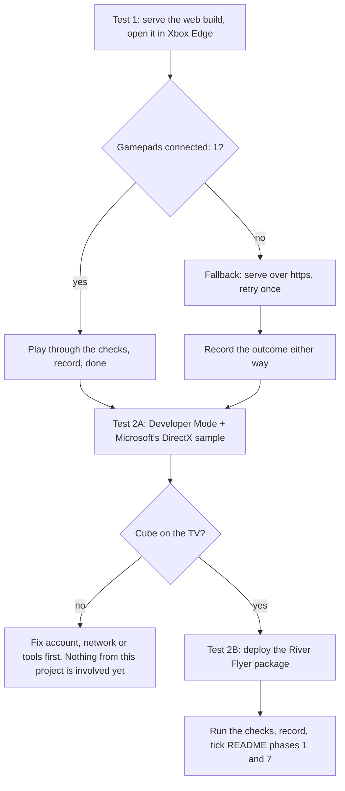

 TDL WSM TN 2026-0X

B. Graham

*Last updated: 17 Sep 2026*

# SOP: Testing River Flyer on an Xbox

## References

- `C:\source_games\River-Flyer\README.md`, section "On an Xbox, a tablet or a Chromebook": the browser build and how to serve it.
- `C:\source_games\River-Flyer-Xbox\README.md`, section "Plan", phases 1 and 7: what these tests close out.
- `C:\source_games\River-Flyer-Xbox\uwp\README.md`: the console package, how it is built, and the deploy routes.
- Microsoft Learn: "Xbox Developer Mode activation", "Xbox Device Portal", "Set up your UWP on Xbox development environment", "Windows.Gaming.Input". Read the activation page before paying anything: the fee, and whether UWP sideloading is still supported, are policy that changes.
- River Flyer v0.5.0 release: `https://github.com/Flinterpop/River-Flyer/releases/tag/v0.5.0` (the `-web.zip` asset is Test 1's input).

## Purpose and scope

River Flyer reaches an Xbox by two routes, and each has one question only a real console can answer. This SOP is the procedure for both.

| Test | Route | The question it answers |
|---|---|---|
| 1 | Browser build in the console's Edge browser, no Developer Mode | Does Edge hand the controller to a page served over plain http on the home network? |
| 2 | Native package sideloaded in Developer Mode | Does the from-scratch engine's console backend, which has never run on a console, come up and play? |

Test 1 takes about twenty minutes and costs nothing. Test 2 takes an afternoon the first time, needs a developer account, and is gated by deploying Microsoft's own sample first so that failures can be blamed on the right thing. Do them in that order.



## Before either test

- PC and Xbox on the same home network. Note the PC's IPv4 address from `ipconfig`.
- One controller at least; two for the two-player checks.
- A USB keyboard is optional but useful: plug it into the Xbox and both routes accept it, which separates "the game is broken" from "the controller is not reaching the game".
- Note the console model (One, One S, One X, Series S, Series X) and its OS build from Settings, System, Console info. Results differ by model and the record is useless without it.
- Keep the record sheet at the end of this document open and fill it in as you go. A test that is not written down did not happen.

## Test 1: the browser build

### Inputs

- `RiverFlyer-v0.5.0-web.zip` from the release, unzipped to a folder, or `C:\source_games\River-Flyer\build-web` after `cmake --build --preset web`. Either way the folder holds exactly `index.html`, `index.js` and `index.wasm`.
- Python on the PC (it is on the PATH).

### Steps

1. Serve the folder from the PC. Port 8000 is taken on this PC; use 8080.

   ```powershell
   python -m http.server 8080 --directory <folder>
   ```

   Windows Firewall asks the first time. Allow it for **private** networks. If the prompt does not appear and the Xbox cannot connect later, the earlier answer was "block": Settings, Firewall, Allow an app, find Python and tick Private.

2. Prove the server before involving the console. On the PC open `http://localhost:8080/` and press Play: the title screen must appear. Then on a phone on the same Wi-Fi open `http://<pc address>:8080/`: the Play page must appear. If the phone cannot reach it, the firewall or the address is wrong and the Xbox will not do better.

3. On the Xbox open **Microsoft Edge**, move the cursor to the address bar with the stick, press A, type `http://<pc address>:8080/` with the on-screen keyboard, and go.

4. Move the cursor onto **Play** and press A. Expect: the page goes fullscreen, the title screen appears with the river scrolling behind it, and the music starts.

5. Read the line at the bottom of the title panel: **Gamepads connected**. This is the question the test exists to answer. Record the number before touching anything else.

6. Run the checks in the table below and record each.

### Checks

| # | Check | Pass |
|---|---|---|
| 1.1 | Title screen renders, river scrolls, trees and boats visible | Yes, and no visible tearing or stutter |
| 1.2 | Music plays after the Play press | Audible through the TV |
| 1.3 | "Gamepads connected" reads 1 or more | The controller reaches the page |
| 1.4 | Stick or d-pad moves the title selection; A on the Players row starts a game | Menu works from the pad |
| 1.5 | In play: stick flies, A fires, up is afterburner, down is the chute, B drops chaff, X jams | All bindings as the README says |
| 1.6 | Rename a pilot: Enter on the pilot row, then the on-screen keyboard from the pad; Back cancels, Start keeps | Name shows on the title row afterwards |
| 1.7 | Play to game over; the score table shows the score | Table updates |
| 1.8 | Close Edge fully, reopen the address, press Play | Scores and names are still there (browser local storage) |
| 1.9 | Press the Xbox button, go to Home, return to Edge | Game resumes where it was; no reload |
| 1.10 | Picture: the whole 960 x 1000 canvas is visible with black bars at the sides, and the HUD at the canvas top is not cut off by the TV's overscan | Nothing clipped |
| 1.11 | Two controllers, two-player game | Both pilots fly independently |

### If it fails

- **Page will not load on the Xbox but loads on the phone.** Retype the address; Edge on Xbox sometimes adds `https://`. Use `http://` explicitly.
- **Play press does nothing.** The cursor was not on the button. Nudge it with the stick until the button highlights, then A. A USB keyboard's Enter also presses it.
- **Gamepads connected: 0.** Two possible causes, and the record must say which was tried:
  1. Edge kept the controller for its own cursor. Press the **View** button (the small one left of the Xbox button) once and read the count again; some Edge builds toggle between cursor and gamepad mode with it.
  2. Edge refuses the Gamepad API on a plain-http address that is not localhost. Serve over https and retry once. Make a self-signed certificate with the OpenSSL that is on this PC, then run the small server below from the folder with the three files. Edge will warn about the certificate; choose to continue to the site.

     ```powershell
     openssl req -x509 -newkey rsa:2048 -nodes -days 365 -keyout key.pem -out cert.pem -subj "/CN=<pc address>"
     ```

     ```python
     # serve_https.py: run from the folder holding index.html, index.js, index.wasm
     import http.server, ssl
     ctx = ssl.SSLContext(ssl.PROTOCOL_TLS_SERVER)
     ctx.load_cert_chain("cert.pem", "key.pem")
     srv = http.server.ThreadingHTTPServer(("0.0.0.0", 8443), http.server.SimpleHTTPRequestHandler)
     srv.socket = ctx.wrap_socket(srv.socket, server_side=True)
     srv.serve_forever()
     ```

     Then open `https://<pc address>:8443/` on the Xbox. If the count becomes 1, the answer is "https required" and the README's serving instructions need that change. If it is still 0 with a USB keyboard working, the answer is "Edge does not expose the controller to pages" and the browser route is keyboard-only on this console.
- **No sound.** Check the TV volume and that Edge is not muted (the tab's speaker icon). The Play press is what unlocks sound; if the page was opened some other way, reload and press Play.
- **Fullscreen dropped.** Escape on a keyboard or B in some Edge modes leaves fullscreen. F on a keyboard puts it back; from the pad, reload the page and press Play again.

## Test 2: the native package in Developer Mode

### Part A: activation and Microsoft's sample (the gate)

Nothing from this project is involved in Part A. Its only purpose is to prove the account, the tools and the network path, so that a failure in Part B is the engine's fault and not the pipeline's.

Inputs: a Microsoft account, a payment method for the Partner Center registration, Visual Studio 2026 with the **Universal Windows Platform development** workload and the C++ UWP tools, and the console.

1. Read Microsoft's "Xbox Developer Mode activation" page. Confirm the current fee and that UWP sideloading is still supported for the console model in hand. If the page says otherwise, stop and re-plan; do not pay.
2. Register at Partner Center as an individual developer.
3. On the console, install **Xbox Dev Mode Activation** from the Store, open it, and note the code it shows. Enter the code at the Partner Center activation page. The app then offers **Switch and restart**. Do it. The console reboots into Developer Mode and shows **Dev Home** instead of the usual dashboard. Retail games are unavailable while in this mode; switching back is a button in Dev Home.
4. In Dev Home: note the console's IP address, turn on **Xbox Device Portal**, and set a user name and password for it. Also note the **Visual Studio pin** option; it is needed the first time Visual Studio pairs.
5. On the PC, open `https://<console address>:11443` in a browser, accept the certificate warning, and log in. The Device Portal home page proves the network path.
6. In Visual Studio create a new project from the **DirectX 11 App (Universal Windows)** template (C++). Set the configuration to **Debug x64**. In the project's debugging properties choose **Remote Machine**, enter the console's address, and set authentication to **Universal (Unencrypted Protocol)**. Press F5. The first deploy copies the debug runtime and may ask for the pin from Dev Home.
7. Pass: a rotating coloured cube on the TV, and the app listed in Dev Home under games and apps. Record the time the first deploy took; it is the baseline for Part B.

If Part A fails: "cannot connect" means a different subnet, the Device Portal off, or the wrong address; "deployment failed" with an architecture message means the configuration is not x64; a pin prompt that never accepts means the pin expired, so show a fresh one in Dev Home. None of these involve River Flyer.

### Part B: the River Flyer package

Inputs: the package built by

```powershell
cd C:\source_games\River-Flyer-Xbox
cmake --preset uwp
cmake --build --preset uwp-release
```

which writes `build-uwp\AppPackages\riverflyer\riverflyer_0.4.0.0_x64_Test\`. Before deploying, open the `.msix` as a zip and confirm it holds `riverflyer.exe`, `AppxManifest.xml` and five files under `Assets\`. The certificate `.cer` is in the first `_Test` folder that was ever built (the key does not change between builds), and the runtime dependency is `Dependencies\x64\Microsoft.VCLibs.x64.14.00.appx`.

1. **Deploy by Device Portal.** Log in, open **My games & apps**, choose **Add**, select the `.msix`, then add the `x64` runtime package from `Dependencies` when asked, and start the install. If it fails with a certificate-chain error (`0x800B0109`), install the `.cer` through the portal's certificate page and retry.
2. **Or deploy by Visual Studio**, which is the route to take when Part B fails, because it shows the engine's log. Open `build-uwp\RiverFlyerXbox.slnx`, set `riverflyer` as the start-up project, choose **Remote Machine** with the console's address and Universal authentication as in Part A, and press F5. The engine writes every `INFO`, `WARNING` and `ERROR` line to the Output pane.
3. In Dev Home, launch the **River Flyer** tile. Expect the blue splash with the gold plane, then the title screen.
4. Run the checks and record each.

### Checks

| # | Check | Pass |
|---|---|---|
| 2.1 | Splash, then title screen with river, trees, boats and text | Renders; text legible on the TV |
| 2.2 | Picture fills the height of the screen with black bars at the sides; HUD and the gold canvas border are fully visible | Nothing in the overscan band |
| 2.3 | "Gamepads connected" reads 1 with one controller, 2 with two | Windows.Gaming.Input works |
| 2.4 | Stick flies, A fires, B chaff, X jam, Start pauses | All bindings |
| 2.5 | Music and effects | Both audible |
| 2.6 | Rename a pilot from the pad; Start keeps | Name shows afterwards |
| 2.7 | Play to game over; score table updates | Recorded |
| 2.8 | Quit the app from Dev Home, relaunch | Scores and names persist (LocalFolder) |
| 2.9 | Xbox button to Home, wait 30 seconds, return | Game resumes; the plane did not teleport (clock reset on resume) |
| 2.10 | Xbox button to Home, wait 5 minutes, return | Either resumes, or restarts cleanly at the title screen; never a crash dialog |
| 2.11 | Turn the controller off mid-game, turn it back on | Game keeps running; controller works again (note whether it came back as pad 1) |
| 2.12 | Two controllers, two-player game | Both pilots fly independently |
| 2.13 | Frame rate by eye against the PC build | Smooth; no stutter or hitching |

### If it fails

- **Install fails.** The Device Portal's message is the diagnosis: dependencies missing, certificate not trusted, or wrong architecture. Part A passing rules out the network.
- **Tile launches then returns to Dev Home.** The app crashed before the first frame. Deploy by Visual Studio and read the Output pane. The first `ERROR` line names the module: `GFX` for the swap chain or device, `AUDIO` for XAudio2, `PLATFORM` for the window. Copy the lines into the record.
- **Black screen with the music playing.** The swap chain presented but nothing drew. Look for `D3D11:` lines in the Output pane; the engine prints the debug layer's messages on device loss.
- **Gamepads connected: 0.** The app is not the foreground activated view, or the controller is assigned elsewhere. Press the Xbox button, return to the app, and read again.
- **No sound.** Look for an `AUDIO:` error at start-up. The same XAudio2 code runs on the PC, so a failure here is a console difference worth recording exactly.
- **Text clipped at the top or sides.** The TV's overscan is eating the canvas edge. Record the TV model and how much is lost; the fix is a safe-area inset in the engine, not in the game.

### Leaving Developer Mode

Dev Home has **Leave Dev Mode**. Before pressing it, read its confirmation: on current builds it removes the developer partition and everything sideloaded, and the console returns to retail. Switching back and forth without leaving keeps the apps.

## Record sheet

Copy this into the notes for each session. One row per check; "Notes" carries anything unusual, however small.

| Field | Value |
|---|---|
| Date | |
| Console model and OS build | |
| Edge version (Test 1) | |
| Package version (Test 2) | |
| PC address, port, http or https | |

| Check | Result (pass / fail / not run) | Notes |
|---|---|---|
| 1.1 to 1.11 | | |
| 2A cube | | |
| 2.1 to 2.13 | | |

When a session is done: tick phase 1 and phase 7 in the River-Flyer-Xbox README if they passed, and open an issue in the repository for each failed check with the record row and any log lines. If Test 1 needed https, update the serving instructions in the River-Flyer README.
